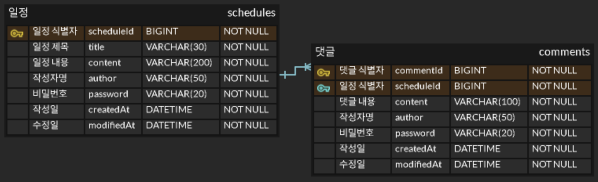

# Scheduler App

Spring Boot와 JPA 기반의 일정 CRUD 및 댓글 작성 기능을 제공하는 애플리케이션입니다.

## 개발 환경


## 주요 기능

- 일정 생성, 조회, 수정, 삭제 (CRUD)
- 작성자 기준 일정 조회
- 수정일 기준 내림차순 조회
- 댓글 생성
- 일정 단건 조회 시 댓글 목록 조회
- 비밀번호 검증 기반 수정 및 삭제
- 사용자 입력값 유효성 검증 (제목, 내용, 댓글)
- JPA Auditing을 통한 생성일 및 수정일 자동 관리

## API 요약

Base URL: `http://localhost:8080`

| Method   | URL                                | 설명         |
|----------|------------------------------------|------------|
| `POST`   | `/schedules`                       | 일정 생성      |
| `GET`    | `/schedules`                       | 전체 일정 조회   |
| `GET`    | `/schedules?author={author}`       | 작성자별 일정 조회 |
| `GET`    | `/schedules/{scheduleId}`          | 일정 단건 조회   |
| `PATCH`  | `/schedules/{scheduleId}`          | 일정 수정      |
| `DELETE` | `/schedules/{scheduleId}`          | 일정 삭제      |
| `POST`   | `/schedules/{scheduleId}/comments` | 댓글 작성      |

상세한 내용은 [API 명세서](./docs/api-spec.md)에서 확인할 수 있습니다.

## ERD



## 프로젝트 구조

```text
 docs
  ├─ api-spec.md
  └─ ERD.png
 src/main
  ├─ java/com/wookjae/scheduler
  │  ├─ controller
  │  ├─ dto
  │  ├─ entity
  │  ├─ repository
  │  ├─ service
  │  └─ SchedulerApplication.java
  └─ resources
     └─ application.properties
```
- `controller`: HTTP 요청 및 응답 처리
- `dto`: 요청 및 응답 데이터 전달
- `entity`: 일정 및 댓글 도메인과 공통 시간 필드 정의
- `repository`: 데이터 접근 (JPA)
- `service`: 일정 및 댓글 생성, 조회, 수정, 삭제 비즈니스 로직 처리

## 3-Layer Architecture와 Request Annotation 분석

### 1) 3 Layer Architecture

본 프로젝트는 Controller, Service, Repository로 구성된 3 Layer Architecture를 적용했습니다.

- `Controller`: 클라이언트의 HTTP 요청을 받아 적절한 Service로 전달하고, 응답을 반환한다.
- `Service`: 비즈니스 로직을 처리하며, 도메인 규칙을 기반으로 데이터를 가공하고 트랜잭션을 관리한다.
- `Repository`: 데이터베이스와의 직접적인 상호작용을 담당하며, JPA를 통해 데이터를 조회 및 저장한다.

3 Layer Architecture 구조를 통해 각 계층의 역할을 분리하여 유지보수성과 확장성을 높이고, 코드의 가독성과 재사용성을 향상시킬 수 있습니다.

### 2) 어노테이션 설명

- `@RequestParam`
  - URL의 쿼리 파라미터를 바인딩할 때 사용한다. (예: `/schedules?author=정욱재`)
  - 주로 선택적인 값이나 필터링 조건 전달에 사용되며, `required=false` 또는 `defaultValue`를 통해 기본값 설정도 가능하다.

- `@PathVariable`
  - URL 경로에 포함된 값을 바인딩할 때 사용한다. (예: `/schedules/{id}`)
  - 특정 자원을 식별하기 위한 경로 변수로 사용된다.

- `@RequestBody`
  - HTTP 요청의 Body(JSON 데이터)를 객체로 변환하여 받아올 때 사용한다.
  - 복잡한 데이터(여러 필드)를 전달할 때 사용되며, DTO 객체로 매핑된다.
  - DTO를 사용함으로써 엔티티와의 의존성을 줄이고 계층 간 역할을 분리할 수 있다.
